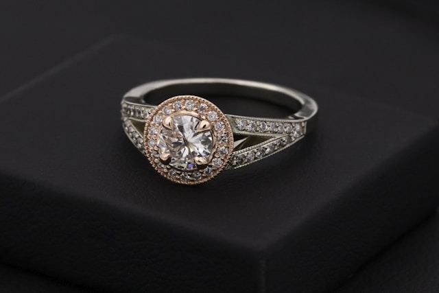

# Nhẫn Kim Cương Thiên Nhiên Cầu Hôn — Tại Sao Sự Thật Của Viên Đá Lại Quan Trọng Đến Vậy?

*Nhẫn cầu hôn kim cương thiên nhiên ổ Halo, vàng trắng 18k — CHJ Diamond*

---

Có một câu hỏi mà tôi được nghe nhiều hơn bất cứ câu hỏi nào khác trong suốt những năm làm việc với kim cương: *"Kim cương thiên nhiên và kim cương nhân tạo khác nhau như thế nào? Và có thực sự cần phải mua thiên nhiên không?"*

Câu hỏi này không dễ trả lời trung thực — vì câu trả lời trung thực đôi khi không có lợi cho doanh số. Nhưng tôi tin rằng người mua xứng đáng được biết sự thật để tự quyết định, thay vì bị dẫn dắt bởi cảm xúc hoặc thông tin không đầy đủ.

Vì vậy, bài viết này không phải để thuyết phục bạn phải mua kim cương thiên nhiên. Mà là để bạn thực sự hiểu bạn đang lựa chọn gì — và tại sao điều đó quan trọng cho một chiếc nhẫn cầu hôn.

---

## Kim Cương Thiên Nhiên Là Gì? — Câu Chuyện Tỷ Năm

Mỗi viên kim cương thiên nhiên là một phép màu địa chất. Nó hình thành ở độ sâu khoảng 150–200 km dưới lòng đất, trong điều kiện nhiệt độ hơn 1.000 độ C và áp suất gấp hàng triệu lần áp suất khí quyển. Quá trình đó mất từ 1 tỷ đến 3,3 tỷ năm.

Sau đó, nhờ các vụ phun trào núi lửa cổ đại, những viên đá này được đẩy lên gần mặt đất, nơi con người tìm thấy chúng hàng nghìn năm sau. Mỗi viên kim cương thiên nhiên bạn thấy ngày hôm nay đã hình thành từ trước khi khủng long xuất hiện trên Trái Đất.

Đó là ý nghĩa thực sự phía sau từ "thiên nhiên". Không phải chỉ là kỹ thuật, không phải chỉ là giá trị tài chính. Mà là một thứ gì đó đã tồn tại qua thời gian theo cách mà không có phòng thí nghiệm nào có thể tái tạo được về mặt lịch sử.

Và khi bạn đặt điều đó lên ngón tay của người mình yêu thương — cùng một lời hứa "mãi mãi" — có một sự cộng hưởng không thể giải thích hoàn toàn bằng lý trí.

---

## Kim Cương Lab-Grown — Không Xấu, Nhưng Khác

*Ổ Halo được thiết kế để tối đa hóa ánh sáng từ viên đá trung tâm — cả thiên nhiên lẫn lab-grown đều lấp lánh, nhưng chỉ một loại hình thành qua hàng tỷ năm*

Kim cương nhân tạo (lab-grown) là một thành tựu khoa học thực sự ấn tượng. Các nhà khoa học đã tìm ra cách tạo ra kim cương trong phòng thí nghiệm với thành phần hóa học hoàn toàn giống kim cương thiên nhiên — cùng cấu trúc tinh thể carbon, cùng độ cứng, cùng khả năng phản chiếu ánh sáng.

Nếu bạn đặt một viên kim cương thiên nhiên và một viên lab-grown cùng thông số cạnh nhau, ngay cả một thợ kim hoàn giàu kinh nghiệm cũng không thể phân biệt bằng mắt thường. Chỉ có thiết bị chuyên dụng mới cho thấy sự khác biệt về cấu trúc vi mô bên trong.

Vậy thì tại sao lại có sự khác biệt giá lớn đến vậy? Và tại sao khi nói đến nhẫn cầu hôn, nhiều người vẫn kiên quyết chọn thiên nhiên?

**Về sự khan hiếm:** Kim cương thiên nhiên có nguồn cung hữu hạn, khai thác ngày càng khó khăn. Kim cương lab-grown thì không — công nghệ ngày càng hiện đại, chi phí sản xuất ngày càng thấp. Trong 5 năm qua, giá lab-grown đã giảm khoảng 60% và xu hướng đó chưa có dấu hiệu dừng lại. Điều này có nghĩa là viên đá bạn mua hôm nay với giá 20 triệu, 5 năm sau thị trường chỉ định giá 6–8 triệu.

**Về giá trị giữ tài sản:** Kim cương thiên nhiên, đặc biệt những viên chất lượng cao có giấy GIA, có xu hướng giữ giá hoặc tăng theo thời gian. Đây không phải lý do duy nhất để chọn thiên nhiên, nhưng là thông tin bạn cần biết trước khi quyết định.

**Về ý nghĩa cá nhân:** Một số người cảm thấy rằng một viên đá hình thành qua hàng tỷ năm có một ý nghĩa sâu sắc hơn với lời hứa "mãi mãi" của hôn nhân. Đây không phải đúng hay sai — chỉ là cảm nhận cá nhân mà không ai có thể thay bạn trả lời.

---

## Tại Sao Việc Mua Nhầm Lại Xảy Ra Nhiều Đến Vậy?

Đây là phần ít người nói thẳng nhất. Và cũng là phần quan trọng nhất.

Thị trường trang sức Việt Nam hiện nay có một vấn đề nghiêm trọng: ranh giới giữa kim cương thiên nhiên, kim cương nhân tạo, và các loại đá tổng hợp khác (moissanite, cubic zirconia) bị cố tình làm mờ bởi một số người bán thiếu lương tâm.

Người mua không chuyên — đặc biệt là những người mua lần đầu để cầu hôn — rất dễ bị dẫn dắt bởi những cụm từ mơ hồ như "kim cương cao cấp", "đá pha lê nhập khẩu", hay "moissanite GIA chuẩn". Tất cả đều nghe chuyên nghiệp, nhưng không một cụm từ nào trong số đó có nghĩa là kim cương thiên nhiên.

Anh Tuấn — một khách hàng tôi gặp năm ngoái — đã bỏ ra 18 triệu cho một chiếc nhẫn được cam đoan là "kim cương thiên nhiên cao cấp". Bốn tháng sau, khi mang đến tiệm kiểm tra vì viên đá bắt đầu mờ đi, kết quả là moissanite. Anh không mất một mình 18 triệu — anh mất cả sự tự tin vào thứ anh đã trao cho cô ấy trong khoảnh khắc quan trọng nhất của cuộc đời.

Đó là lý do tại sao khi ai đó hỏi tôi về nhẫn kim cương thiên nhiên cầu hôn, câu trả lời đầu tiên của tôi không phải là báo giá. Mà là: *"Hãy để tôi giải thích trước cách để chắc chắn bạn nhận được điều mình trả tiền."*

---

## Cách Xác Minh Kim Cương Thiên Nhiên — Đơn Giản Hơn Bạn Nghĩ

*Ánh sáng này là kết quả của giác cắt Excellent trên kim cương thiên nhiên — ổ Halo với các viên phụ bao quanh tạo hiệu ứng "vầng hào quang" đặc trưng*

Điều tốt là: xác minh kim cương thiên nhiên thật không đòi hỏi bạn phải có kiến thức chuyên sâu. Chỉ cần một công cụ — giấy chứng nhận từ phòng thí nghiệm độc lập quốc tế.

**GIA (Gemological Institute of America)** là tổ chức kiểm định đá quý uy tín nhất thế giới, phi lợi nhuận, không bán kim cương. Giấy chứng nhận GIA luôn ghi rõ "Natural" nếu là kim cương thiên nhiên, hoặc "Laboratory-Grown" nếu là nhân tạo. Không có vùng xám, không có sự mơ hồ.

**Cách xác minh trong 30 giây:** Mỗi giấy GIA đều có mã số report. Bạn vào **report.gia.edu**, nhập mã số đó — toàn bộ thông tin viên đá hiện ra tức thì, bao gồm cả dòng "Natural" hay "Laboratory-Grown". Làm điều này ngay tại cửa hàng, trước khi trả tiền.

Nếu người bán không có giấy GIA hoặc IGI, hoặc ngần ngại khi bạn muốn tra mã — đó là câu trả lời đủ rõ ràng để bạn ra về.

---

## Câu Chuyện Của Anh Tuấn — Và Điều Anh Muốn Tặng Cho Cô Ấy

Anh Tuấn — người tôi nhắc đến lúc đầu — đã quay lại CHJ Diamond sau sự cố chiếc nhẫn moissanite. Lần này anh chỉ có một yêu cầu duy nhất khi bước vào: *"Chị cho anh xem giấy GIA trước. Anh sẽ tự tra mã. Nếu đúng thì anh mới xem nhẫn."*

Tôi đồng ý ngay. Chúng tôi lấy ra ba viên với ba mức giá khác nhau. Anh cầm điện thoại, vào GIA.org, nhập từng mã. Từng viên đều hiện ra thông tin khớp hoàn toàn, đều ghi rõ "Natural".

Anh đã chọn viên kim cương thiên nhiên 0.42 carat, màu H, VS2, cắt Excellent, giá 24 triệu. Không hoành tráng nhất, nhưng giác cắt Excellent khiến nó tỏa sáng hơn nhiều viên to hơn mà anh đã xem ở chỗ khác.

Tôi không biết buổi cầu hôn của anh diễn ra như thế nào. Nhưng anh nhắn lại cho tôi một tin nhắn ngắn tối hôm sau: *"Khi cô ấy hỏi 'anh ơi kim cương này thật không?', anh mở điện thoại cho cô ấy tự tra. Mặt cô ấy lúc đó — anh không diễn tả được đâu chị ơi."*

Đó là khoảnh khắc mà không có chiếc nhẫn 100 triệu nào mua được — nếu không có sự chắc chắn đằng sau nó.

---

## Những Điều Cần Chuẩn Bị Trước Khi Đi Mua

Nếu bạn đang đọc bài này và sắp đi mua nhẫn cầu hôn kim cương thiên nhiên, đây là ba điều tôi khuyên bạn chuẩn bị kỹ trước.

**Thứ nhất: Xác định ngân sách thực tế.** Kim cương thiên nhiên đẹp và có giấy GIA tồn tại ở nhiều mức giá — từ khoảng 15 triệu đến hàng trăm triệu. Không cần phải ngại ngùng về con số. Điều quan trọng là tìm đúng viên đá trong ngân sách đó, không phải bị đẩy ra ngoài ngân sách vì áp lực.

**Thứ hai: Ưu tiên giác cắt (Cut) trước.** Đây là yếu tố duy nhất bạn có thể nhìn thấy trực tiếp bằng mắt — nó quyết định độ sáng và "lửa" của viên đá. Một viên 0.3 carat cắt Excellent đẹp hơn đáng kể viên 0.5 carat cắt Good. Đừng hy sinh giác cắt để lấy kích thước.

**Thứ ba: Không mua nếu không có giấy GIA hoặc IGI.** Đây là nguyên tắc không thỏa hiệp. Dù người bán cam đoan mạnh đến đâu, dù giá có vẻ hấp dẫn đến đâu — không có giấy chứng nhận từ phòng thí nghiệm độc lập thì không có cơ sở nào để tin vào chất lượng.

---

## CHJ Diamond — Cam Kết Của Chúng Tôi

*Mỗi chiếc nhẫn tại CHJ Diamond đều đi kèm giấy chứng nhận GIA hoặc IGI — mã số có thể tra cứu trực tiếp online ngay tại cửa hàng*

Tại CHJ Diamond, mỗi viên kim cương chúng tôi bán đều đi kèm giấy chứng nhận GIA hoặc IGI từ phòng thí nghiệm gốc — không phải bản sao, không phải bản tự in. Bạn có thể dùng mã số trên giấy để tra cứu trực tiếp trên website của GIA và IGI ngay tại cửa hàng. Không có gì để giấu, vì không có gì cần giấu.

Chúng tôi cũng không bán "kim cương" mà không nói rõ đó là thiên nhiên hay lab-grown. Mỗi sản phẩm được ghi rõ thông tin, và tư vấn viên của chúng tôi được đào tạo để giải thích sự khác biệt một cách trung thực — kể cả khi điều đó có nghĩa là khuyên bạn chọn sản phẩm ở mức giá thấp hơn phù hợp hơn với nhu cầu thực tế.

Nhiều khách hàng đến với CHJ sau khi đã mua sai ở chỗ khác. Như anh Tuấn — và hàng chục người khác có câu chuyện tương tự mà tôi đã nghe. Tất cả đều có một điểm chung: lần đầu họ mua nơi không có giấy chứng nhận quốc tế. Lần sau họ không lặp lại sai lầm đó nữa.

---

## Lời Kết

Nhẫn kim cương thiên nhiên cầu hôn không chỉ là một món trang sức. Nó là lời hứa. Và lời hứa đẹp nhất là lời hứa có thể kiểm chứng được.

Khi bạn quyết định tặng kim cương thiên nhiên, bạn đang tặng một thứ đã tồn tại qua hàng tỷ năm, một thứ hiếm có và không thể tái tạo y hệt, một thứ sẽ không thay đổi theo thời gian dù thế giới xung quanh có thay đổi thế nào.

Hãy chắc chắn rằng thứ bạn tặng thực sự là thứ bạn muốn tặng. Hãy xác minh. Hãy kiểm tra. Và hãy mua ở nơi không có gì để giấu.

CHJ Diamond ở đây cho câu hỏi đó. Hãy đến gặp chúng tôi — cầm theo điện thoại, và tự tra mã của viên đá bạn định mua trước khi rút ví.

---
*CHJ Diamond — Kim cương thiên nhiên, chứng nhận quốc tế GIA/IGI | chunghieudiamond.com*

---

> ### Tải miễn phí: Cẩm nang chọn nhẫn cầu hôn kim cương
> **7 điều phải biết trước khi mua** — để không mua hớ, không chọn sai. Bản PDF đọc trong 10 phút, do đội ngũ CHJ Diamond biên soạn, nói thẳng những gì người bán thường giấu.
>
> **[Tải cẩm nang miễn phí tại đây](https://huele191084-ctrl.github.io/chj-diamond-wiki/nhan-cau-hon/)**
>
> *CHJ Diamond — Kim cương thiên nhiên chuẩn GIA | chunghieudiamond.com*

## Bài viết liên quan

- [Nhẫn Cầu Hôn Kim Cương: Hướng Dẫn Chọn Viên Kim Cương](nhan-cau-hon-kim-cuong.md)
- [Kim Cương Thiên Nhiên vs Nhân Tạo](kim-cuong-thien-nhien-vs-nhan-tao.md)
- [Cách Nhận Biết Kim Cương Thật: 7 Phương Pháp](cach-nhan-biet-kim-cuong-that.md)
